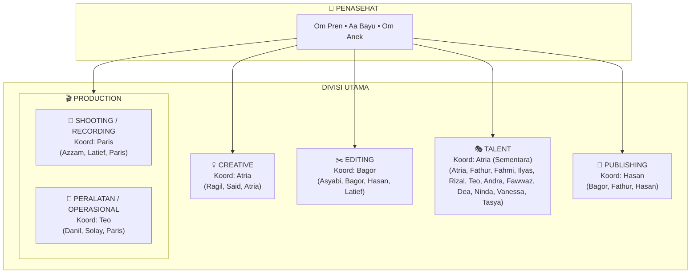
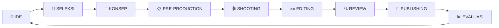

# PRD — PROJECT INFORMATION IKADA

**Nama:** Project Konten IKADA  
**Status:** Inisiasi / Draft  
**Fungsi:** Sumber informasi untuk mengenal, memahami, dan menyamakan pemahaman mengenai Project Konten IKADA.

> **“Dari tongkrongan, jadi cerita. Dari cerita, jadi konten. Dari konten, jadi karya.”**

---

## 1. TUJUAN DOKUMEN

Dokumen ini dibuat sebagai sumber informasi bersama untuk teman-teman IKADA.

Tujuannya agar setiap orang dapat memahami project ini tanpa harus mendapatkan penjelasan satu per satu, mulai dari alasan project dibuat, arah konten, struktur tim, pembagian tugas, alur kerja, aturan, sampai target perkembangannya.

Dokumen ini **bukan website bisnis, bukan portal publik, dan bukan sistem organisasi yang kaku**.

Fungsinya sederhana:

> **Mengenalkan Project Konten IKADA dan bagaimana kita akan menjalankannya bersama.**

---

## 2. GAMBARAN PROJECT

IKADA adalah project konten berbasis tongkrongan yang mengangkat kehidupan sehari-hari, masyarakat, kebersamaan, hiburan, pengalaman, olahraga, pendidikan, musik, review, challenge, dan berbagai cerita yang dekat dengan lingkungan kita.

Project ini dibangun dari aktivitas dan interaksi nyata di tongkrongan, lalu dikembangkan menjadi konten yang bisa dinikmati lebih luas.

Fokus utama IKADA adalah **menghadirkan hiburan yang bermakna dan menjadi wadah bagi kawan-kawan IKADA untuk berkembang serta menemukan potensi terbaik dirinya**. Lewat karya bersama, kita buktikan energi positif tongkrongan bisa menghasilkan karya yang membanggakan.

Konten IKADA diharapkan terasa:
**Natural, dekat, menghibur, kreatif, spontan, relatable, positif, dan punya cerita.**

---

## 3. ARAH PROJECT

Project Konten IKADA diarahkan untuk:
- **Membangun identitas konten IKADA**
- **Menghasilkan konten secara rutin**
- **Menemukan format yang cocok dengan karakter tim**
- **Meningkatkan kualitas produksi**
- **Membangun audience**
- **Menciptakan sistem kerja yang bisa terus berkembang**

Setiap konten diharapkan memiliki nilai bagi penonton, baik berupa hiburan, informasi, pengalaman, cerita, maupun interaksi.

Pengembangan kemampuan anggota menjadi dampak positif dari proses, tetapi **fokus utama tetap project konten IKADA**.

---

## 4. KARAKTER KONTEN IKADA

IKADA tidak harus mengikuti semua tren. Tren boleh digunakan ketika memang cocok dengan karakter dan tujuan konten.

Karakter yang ingin dibangun:
- **Natural**: Tidak terasa dibuat-buat.
- **Dekat dengan masyarakat**: Mengangkat hal-hal yang ada di sekitar kita.
- **Menghibur**: Konten harus punya alasan bagi orang untuk terus menonton.
- **Positif**: Tetap seru tanpa harus merugikan orang.
- **Kreatif**: Tidak takut mencoba ide dan format baru.
- **Spontan**: Memberikan ruang untuk momen tak terduga.
- **Relatable**: Dekat dengan kehidupan sehari-hari.
- **Punya cerita**: Bukan sekadar kumpulan footage.

> **Konten bagus bukan hanya yang ramai, tetapi yang membuat orang mengenali dan ingin melihat konten IKADA berikutnya.**

---

## 5. STRUKTUR PROJECT IKADA

Struktur utama Project Konten IKADA terdiri dari **Penasehat dan lima bidang utama**.



### 🧭 PENASEHAT
- **Om Pren**
- **Aa Bayu**
- **Om Anek**

Penasehat berada pada bagian paling atas sebagai pihak yang memberikan arahan, pertimbangan, dan masukan terhadap project.

---

## 6. CREATIVE — KONSEP & SKRIP

- **Koordinator:** Atria
- **Anggota:** Ragil, Said, Atria

### Fokus Creative
Creative bertanggung jawab menentukan **apa yang akan dibuat**.

Tugasnya meliputi:  
Mencari dan mengembangkan ide, menentukan tema, tujuan, target penonton, konsep, alur cerita, skrip jika diperlukan, hook, ending, talent, lokasi, properti, durasi, serta memberikan brief produksi.

### Output minimal
Judul kerja, tema, tujuan, konsep, alur, hook, ending, talent, lokasi, kebutuhan alat/properti, dan catatan produksi.

Creative memberikan arah cerita, bukan mengambil alih pekerjaan shooting, editing, atau publishing.

---

## 7. PRODUCTION

Production sekarang dibagi menjadi **dua bagian**, agar tanggung jawab di lapangan lebih jelas.

### 7.1 SHOOTING / RECORDING
- **Koordinator:** Paris
- **Anggota:** Azzam, Latief, Paris

#### Fokus
Mengubah konsep menjadi footage.

Tugasnya mencakup:  
Persiapan shooting, camera setup, framing, posisi talent, pengambilan footage, variasi shot, audio, retake, mengikuti brief Creative, memastikan footage cukup, menjaga alat saat digunakan, dan mengecek hasil sebelum meninggalkan lokasi.

#### Prinsip
> **“Konsep sudah jelas, footage harus cukup.”**

---

### 7.2 PERALATAN / OPERASIONAL
- **Koordinator:** Teo
- **Anggota:** Danil, Solay, Paris

#### Fokus
Memastikan seluruh kebutuhan peralatan produksi siap digunakan.

Tugasnya mencakup:  
Mengecek kamera, baterai, memory, tripod, microphone, lighting, kabel, charger, membawa dan mengembalikan alat, membantu setup dan breakdown, serta melaporkan jika ada masalah pada peralatan.

#### Prinsip
> **“Sebelum talent siap, alat harus sudah siap.”**

#### Catatan Koordinasi
- Koordinator Peralatan memastikan kebutuhan teknis tersedia sebelum shooting.
- Koordinator Shooting memastikan penggunaan alat dan kebutuhan shooting berjalan sesuai rencana.
- Keduanya bekerja bersama dengan Creative dan tim Production lainnya.

---

## 8. EDITING — POST-PRODUCTION

- **Koordinator:** Bagor
- **Anggota:** Asyabi, Bagor, Hasan, Latief

### Fokus
Mengubah footage menjadi video yang enak ditonton.

Tugasnya:  
Mengumpulkan dan memilih footage, rough cut, menyusun alur, mengatur tempo, membuang bagian yang tidak perlu, subtitle, musik, sound effect, audio, visual, versi platform, preview, revisi, dan final video.

### Standar
Video harus mudah dipahami, opening menarik, audio jelas, tempo tidak membosankan, efek tidak berlebihan, dan cerita tetap utuh.  
Editing tidak boleh mengubah makna atau konteks secara menyesatkan.

---

## 9. TALENT

- **Koordinator:** Atria (Sementara) *(sebelumnya Dea)*
- **Anggota:** Atria, Fathur, Fahmi, Ilyas, Rizal, Teo, Andra, Fawwaz, Dea, Ninda, Vanessa, Tasya

### Fokus
Membawa cerita dan karakter IKADA ke depan kamera.

Tugasnya:  
Memahami konsep, hadir sesuai jadwal, mengikuti arahan, menjaga energi shooting, tampil natural, berinteraksi, dan melakukan improvisasi jika sesuai dengan kebutuhan konten.

Karakter setiap orang bisa menjadi kekuatan konten: serius, lucu, spontan, kompetitif, santai, kritis, dan sebagainya. Talent tetap mengikuti kebutuhan cerita serta arahan produksi.

> **Catatan:**
> - Koordinator Talent saat ini dipegang sementara oleh **Atria** (yang juga memimpin divisi Creative).
> - Tambahan anggota talent baru: **Ninda**, **Vanessa**, **Tasya**.
> - **Teo** saat ini memiliki peran aktif di **Talent** sekaligus menjadi **Koordinator Peralatan Production**.

---

## 10. PUBLISHING

- **Koordinator:** Hasan
- **Anggota:** Bagor, Fathur, Hasan

### Fokus
Memastikan konten sampai kepada audience dengan baik.

Tugasnya:  
Menerima final video, pengecekan terakhir, menentukan platform, caption, cover/thumbnail, hashtag jika relevan, jadwal upload, upload, pengecekan setelah tayang, monitoring, pencatatan performa, dan memberikan feedback kepada Creative.

> **Publishing bukan sekadar upload.**  
> **Konten → Penonton → Data → Evaluasi → Ide berikutnya.**

---

## 11. RINGKASAN STRUKTUR KOORDINATOR

```text
PENASEHAT
Om Pren — Aa Bayu — Om Anek
        │
        ├── CREATIVE
        │   Koordinator: Atria
        │
        ├── PRODUCTION
        │   │
        │   ├── SHOOTING / RECORDING
        │   │   Koordinator: Paris
        │   │
        │   └── PERALATAN / OPERASIONAL
        │       Koordinator: Teo
        │
        ├── EDITING
        │   Koordinator: Bagor
        │
        ├── TALENT
        │   Koordinator: Atria (Sementara)
        │
        └── PUBLISHING
            Koordinator: Hasan
```

*Sekretaris dan Bendahara belum dimasukkan dalam struktur ini.*

---

## 12. ALUR KERJA KONTEN



Setiap konten mengikuti siklus berkelanjutan:

1. **IDE**: Muncul dari anggota, tongkrongan, pengalaman, masyarakat, tren, atau kejadian sehari-hari.
2. **SELEKSI**: Ide dipilih berdasarkan kesesuaian dengan karakter IKADA dan kemampuan produksi.
3. **KONSEP**: Creative mengembangkan ide menjadi konsep yang bisa dijalankan.
4. **PRE-PRODUCTION**: Menentukan talent, lokasi, alat, waktu, kebutuhan, dan persiapan lainnya.
5. **SHOOTING**: Production mengambil footage.
6. **EDITING**: Footage diolah menjadi video.
7. **REVIEW**: Konten diperiksa sebelum dipublikasikan.
8. **PUBLISHING**: Konten dipublikasikan ke platform yang dipilih.
9. **EVALUASI**: Tim melihat hasil dan menentukan apa yang perlu dilakukan berikutnya.

---

## 13. HUBUNGAN ANTAR DIVISI

Pembagian tugas dibuat supaya jelas, bukan untuk membuat sekat.

- **Creative** → *Apa yang dibuat*
- **Production Shooting** → *Bagaimana footage diambil*
- **Production Peralatan** → *Apa saja yang harus siap secara teknis*
- **Editing** → *Bagaimana footage menjadi video*
- **Talent** → *Bagaimana cerita dibawakan*
- **Publishing** → *Bagaimana konten disampaikan kepada audience*

Semua anggota tetap boleh memberikan masukan. Perubahan besar terhadap konsep sebaiknya dibicarakan dengan pihak yang bertanggung jawab.

---

## 14. PILAR KONTEN IKADA

1. **SPORT**: Futsal, basket, badminton, voli, tenis meja, running, skill challenge, 1v1, pertandingan kecil, olahraga bersama masyarakat.
2. **PENDIDIKAN**: Kuis, pengetahuan umum, sejarah, bahasa, budaya, fakta lokal, teknologi, literasi, dan belajar dari masyarakat.
3. **GUYONAN**: Cerita tongkrongan, tebak-tebakan, improvisasi, roasting ringan, no laugh challenge, permainan spontan.
4. **CHALLENGE**: Olahraga, makanan, budget, skill, random, antar anggota, maupun bersama masyarakat, dengan tetap memperhatikan keamanan.
5. **REVIEW**: Makanan, warung, tempat nongkrong, lapangan, event, produk lokal, jajanan, tempat wisata, dan kegiatan masyarakat.
6. **KEBERSAMAAN**: Nongkrong, makan, perjalanan, olahraga, kegiatan sosial, behind the scenes, kegagalan, momen spontan, dan perjalanan IKADA.
7. **MUSIC**: Cover, acoustic, jamming, tebak lagu, battle musik, karaoke challenge, talent lokal, dan cerita musik.
8. **MASYARAKAT**: Street interview, opini publik, cerita pekerjaan, UMKM, komunitas, anak muda, tokoh lokal, tradisi, permainan, dan kegiatan sosial.

> **Tips Kombinasi:** Pilar dapat digabung sesuai konsep (contoh: *Sport + Guyonan*, *Review + Masyarakat*, *Music + Kebersamaan*, *Pendidikan + Challenge*).

---

## 15. FORMAT KONTEN

- **Short Content**: Konten pendek dengan penyampaian cepat.
- **Long Content**: Konten dengan cerita atau pembahasan yang lebih panjang.
- **Series**: Format yang dibuat berulang dan memiliki identitas sendiri.
- **Interview**: Percakapan dengan anggota maupun masyarakat.
- **Challenge**: Konten berbasis tantangan.
- **Review**: Mencoba sesuatu lalu memberikan pengalaman dan penilaian.
- **Behind The Scenes**: Menampilkan proses di balik konten.

---

## 16. FORMULA DASAR KONTEN

> **HOOK → PERTANYAAN / MASALAH → PROSES → MOMEN UTAMA → HASIL / PUNCHLINE → CLOSING**

Formula ini bukan aturan mati. Setiap konsep boleh memiliki struktur sendiri selama tetap menghasilkan cerita yang menarik dan mudah dipahami.

---

## 17. BANK IDE AWAL

Beberapa ide untuk eksplorasi:
- Anak IKADA vs masyarakat
- Siapa paling jago di antara kita?
- Modal 20 ribu bisa dapat apa?
- Jangan ketawa challenge
- Sehari jadi anak paling hemat
- Tebak-tebakan dengan orang random
- Battle antar anggota
- Kita coba tempat ini
- Kita review jujur
- Seberapa kompak tongkrongan kita?
- Siapa yang paling...?
- Yang kalah harus...
- Misi rahasia di tongkrongan
- Sehari mengikuti aktivitas teman
- Bikin sesuatu dari nol
- Cerita dari orang yang kita temui
- Ternyata anak tongkrongan tidak sejago itu
- Tongkrongan kita kalau disuruh...
- Challenge bersama masyarakat
- Belajar sesuatu dari orang random

---

## 18. CARA KITA BEKERJA (KULTUR & PRINSIP)

- **Komunikasi kalau ada kendala.**
- **Jangan menghilang saat memegang tugas.**
- **Hargai semua divisi.**
- **Kritik pekerjaan, bukan orangnya.**
- **Jangan menjatuhkan teman yang sedang belajar.**
- **Keputusan penting dibicarakan.**
- **Jadwal dihargai.**
- **Materi project dijaga.**
- **Semua anggota boleh mengusulkan ide.**
- **Semua divisi saling membutuhkan.**

Tidak ada divisi yang dianggap paling penting. Project hanya bisa berjalan apabila semua bagian saling mendukung.

---

## 19. ATURAN KONTEN

Konten IKADA harus tetap sesuai dengan karakter project.

**Hindari:**
Merugikan orang, mempermalukan secara berlebihan, mengeksploitasi masalah pribadi, membuka data pribadi, bullying, hate/SARA, penggunaan karya tanpa hak, serta challenge yang membahayakan.

Guyonan boleh seru, tetapi tidak merendahkan.
> **“Kalau ragu, review dulu sebelum upload.”**

---

## 20. TARGET MINGGUAN

- **Creative**: Sekitar 5 ide dan minimal 1 konsep siap produksi.
- **Production — Shooting**: Minimal 1 sesi shooting dengan footage yang cukup.
- **Production — Peralatan**: Memastikan alat dan kebutuhan teknis siap sebelum shooting.
- **Editing**: 1–2 video final sesuai kapasitas.
- **Talent**: Hadir dan siap sesuai brief.
- **Publishing**: 1–2 posting serta pencatatan performa.

*Target dapat dinaikkan setelah workflow stabil.*

---

## 21. TARGET KONTEN

### Tahap Awal
**1–2 konten utama per minggu**  
Fokus utama: Membangun kebiasaan produksi, menemukan format, dan belajar dari hasil.

### Setelah Workflow Stabil
**2–4 konten per minggu**  
Jumlah tidak menjadi tujuan utama apabila kualitas dan kemampuan tim belum mendukung.

---

## 22. SCHEDULE MINGGUAN

| Hari | Agenda Utama | Fokus & Penanggung Jawab |
| :--- | :--- | :--- |
| **Senin** | Brainstorming + Seleksi Ide | Creative & All Crew |
| **Selasa** | Pre-production + Brief + Persiapan Alat & Lokasi | Creative, Prod Peralatan, Prod Shooting |
| **Rabu – Kamis** | Shooting / Recording | Prod Shooting, Peralatan, Talent |
| **Kamis – Jumat** | Editing + Revisi | Editing |
| **Sabtu** | Review Final + Persiapan Publishing | Editing, Creative, Publishing |
| **Minggu** | Publishing + Monitoring + Evaluasi | Publishing & All Crew |

*Jadwal dapat menyesuaikan kondisi lapangan selama komunikasinya jelas.*

---

## 23. EVALUASI KONTEN

Setelah konten dipublikasikan, tim memantau:
- **Metrik Kuantitatif**: Views, Watch Time, Retention, Likes, Comments, Shares, Saves, Follower Growth.
- **Kualitas Kualitatif**: Apakah hook kuat? Bagian mana yang menarik atau membosankan? Apakah konsep jelas? Apakah footage cukup? Apakah editing terlalu panjang? Apakah karakter IKADA terasa?

---

## 24. PERTANYAAN EVALUASI

Setiap evaluasi harus berusaha menjawab:
1. **Apa yang harus diulang?**
2. **Apa yang harus diperbaiki?**
3. **Apa yang harus dihentikan?**
4. **Apa yang belum pernah kita coba?**

> **“Bukan mencari siapa yang salah, tetapi apa yang harus diperbaiki supaya konten berikutnya lebih baik.”**

---

## 25. TARGET PERKEMBANGAN PROJECT

- **BULAN 1 — MEMULAI**: Membangun ritme kerja, mencoba format, mengenali karakter tim, dan menghasilkan sekitar 4–8 konten.
- **BULAN 2–3 — MEMPERKUAT**: Memperkuat identitas, membuat series, meningkatkan kualitas, memahami audience, dan menjaga konsistensi.
- **JANGKA PANJANG — BERKEMBANG**: IKADA dapat berkembang menjadi tim kreatif, media komunitas, partner kolaborasi, penyelenggara kegiatan, dan brand konten dengan ciri sendiri.

---

## 26. PENGEMBANGAN ANGGOTA

Pengembangan kemampuan merupakan **dampak positif dari project**, bukan tujuan utama.
- **Creative** belajar berpikir dan storytelling.
- **Production** belajar teknis dan problem solving.
- **Editing** belajar ketelitian dan rasa.
- **Talent** belajar komunikasi dan percaya diri.
- **Publishing** belajar strategi dan membaca data.

> **“Project-nya berkembang, orang-orang di dalamnya juga ikut berkembang.”**

---

## 27. PENUTUP

IKADA tidak harus langsung besar. Yang penting project mulai berjalan, ide terus muncul, produksi terus dilakukan, konten terus diperbaiki, dan semua orang memahami perannya.

Kita tidak harus langsung sempurna. Kita mulai dari yang ada, belajar dari proses, lalu berkembang bersama.

> **Dari tongkrongan, jadi cerita.**  
> **Dari cerita, jadi konten.**  
> **Dari konten, jadi karya.**
